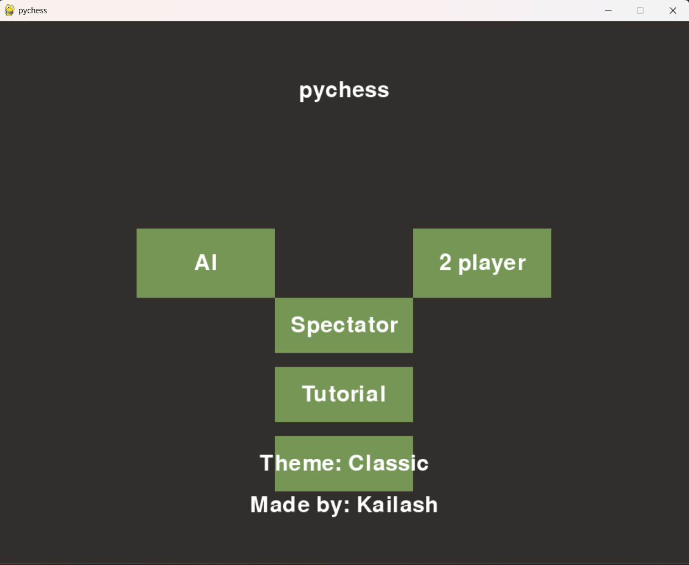
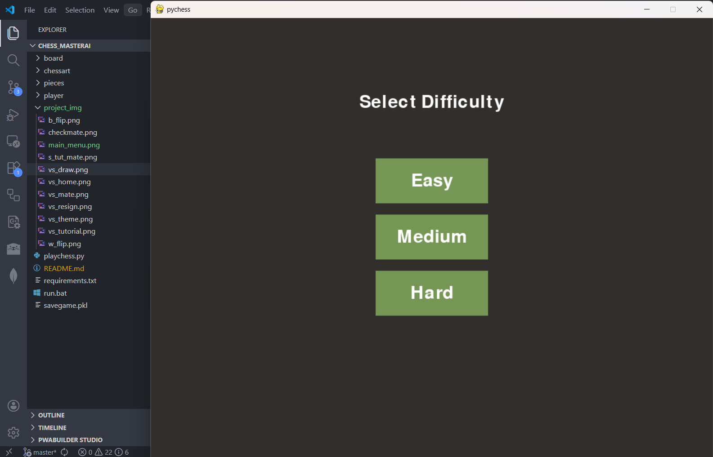
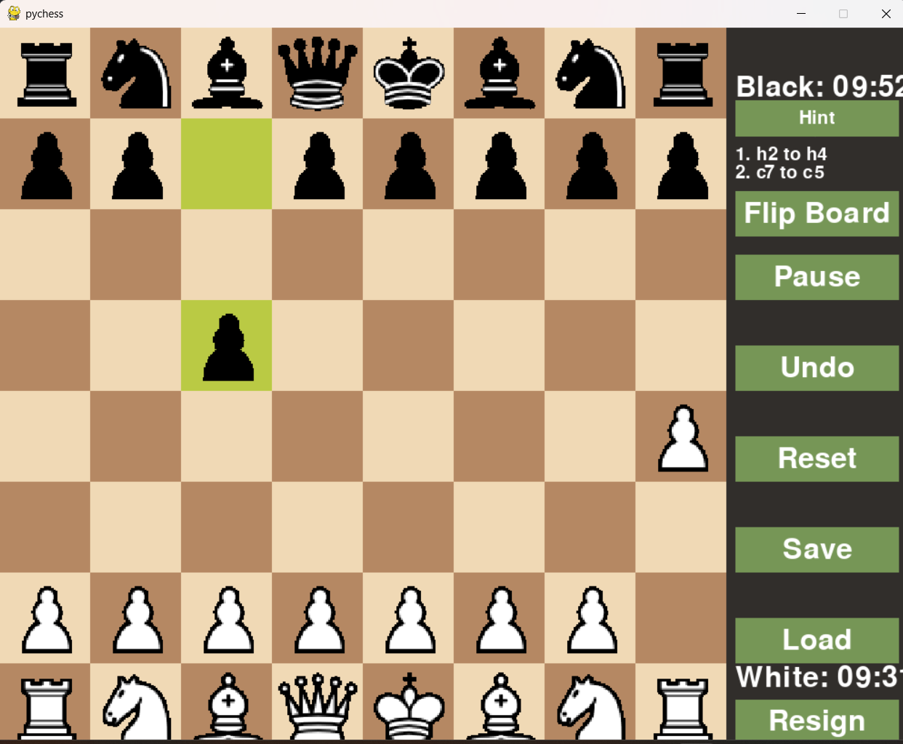
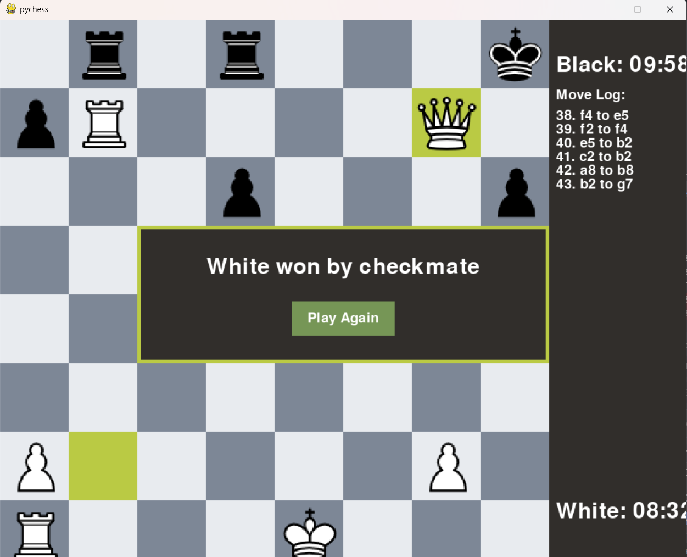
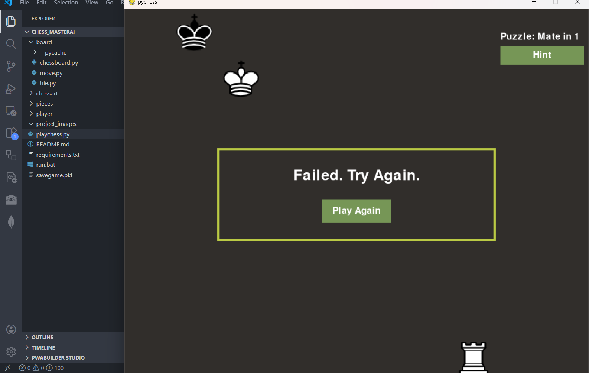
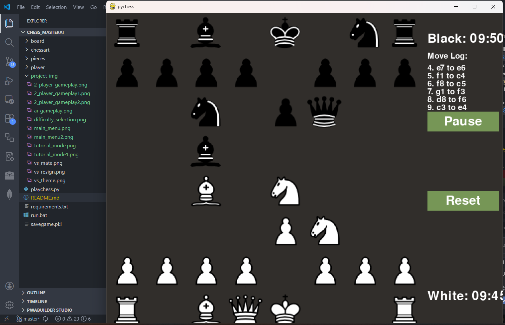
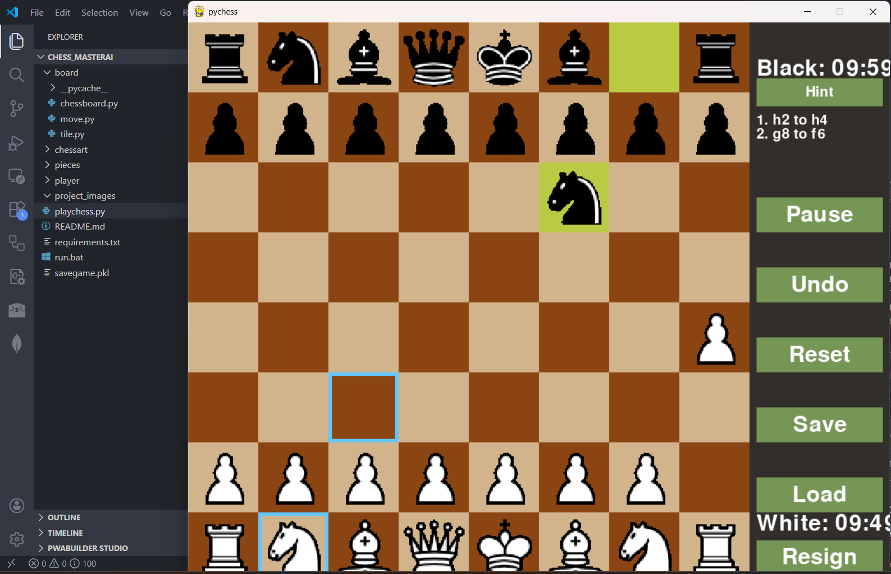
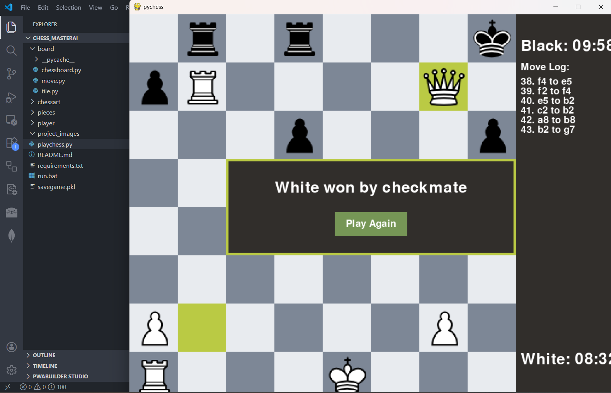

# Chess Game

## Technologies used:
Python with pygame module

## Project Description:
This is a feature-rich Chess game built using Python with the Pygame module for the GUI. It offers multiple game modes and utilities for both casual play and learning.

### Game Modes:
1. **2 Player**: Play against another human locally.
2. **AI Mode**: Play against an AI powered by the Minimax algorithm with Alpha-Beta pruning. Supports multiple difficulty levels (Easy, Medium, Hard).
3. **Tutorial Mode**: Practice specific scenarios like "Mate in 1" or "Mate in 2" with AI assistance.
4. **Spectator Mode**: Watch the AI play against itself.

### Features:
- **Game Mechanics**: Full implementation of chess rules including Castling, En Passant, Pawn Promotion, Check, Checkmate, and Stalemate detection.
- **GUI**: Interactive board with legal move highlighting, move history log, and visual indicators for last moves.
- **Utilities**: 
  - Undo/Reset functionality.
  - Save and Load game state.
  - Pause/Resume.
  - Timer for both players.
  - Theme Selector (Classic, Green, Blue, Wood, Dark).
  - Sound effects for moves and captures.

## Files Description:

1. **board/**: 
      - `chessboard.py`: Defines the `board` class which initializes the 8x8 grid of `Tile` objects and places pieces in their starting positions.
      - `move.py`: Contains the `move` class responsible for game logic, including move validation, check/checkmate detection, and handling special moves like castling and en passant.
      - `tile.py`: Defines the `Tile` class, representing a single square on the board which may contain a piece.

2. **chessart/**: Contains the PNG images for chess pieces and UI elements (e.g., highlight squares).

3. **pieces/**: Contains individual classes for each chess piece (King, Queen, Rook, Bishop, Knight, Pawn) and a `NullPiece` class for empty squares. Each class defines its specific movement rules.

4. **player/**:
      - `AI.py`: Implements the AI logic using the Minimax algorithm with Alpha-Beta pruning. It includes an evaluation function that considers material value and positional factors (Piece-Square Tables).

5.  **playchess.py**: The main entry point of the application. It initializes the Pygame window, handles user input, manages the game loop for different modes, and renders the GUI.

## Screenshots:

1. **Main Menu**: 
   

2. **Difficulty Selection**:
   

3. **2 Player Gameplay**:
   
   
   

4. **AI Gameplay**:
   

5. **Tutorial Mode**:
   
   

6. **Spectator Mode**:
   

7. **Move Guidance & Highlights**:
   

8. **Theme Selector**:
   
   

9. **Game Over Popup**:
   

10. **Save/Load & Options**:
    

## Improvements
The AI evaluation function currently uses material balance and piece-square tables. It could be further improved by incorporating more advanced positional understanding (e.g., pawn structure, king safety, mobility). Deep learning models could also be integrated for more human-like play.

## How to Run the Application
1. Clone the repository:
   ```bash
   git clone https://github.com/pongpong-zigzag/Chess-game-AI.git
   cd Chess-game-AI
   ```

2. Install dependencies:
   ```bash
   pip install -r requirements.txt
   ```

3. Run the game:
   ```bash
   python playchess.py
   ```
